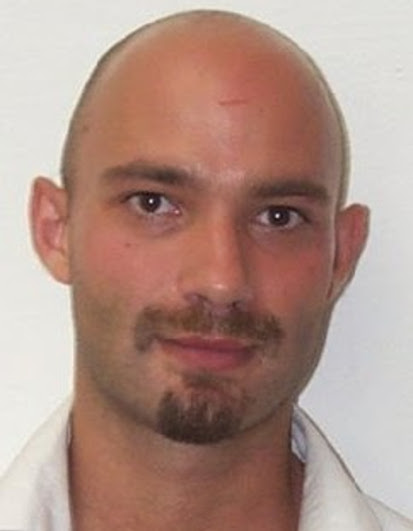
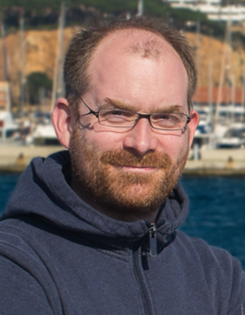
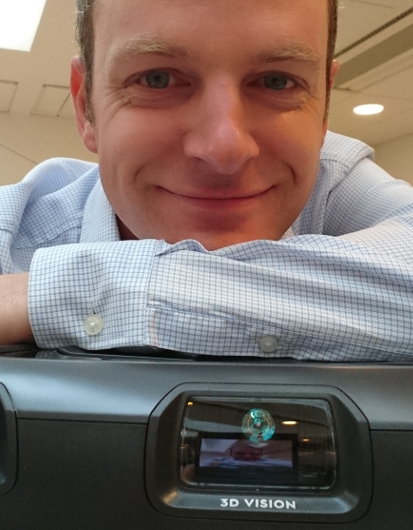
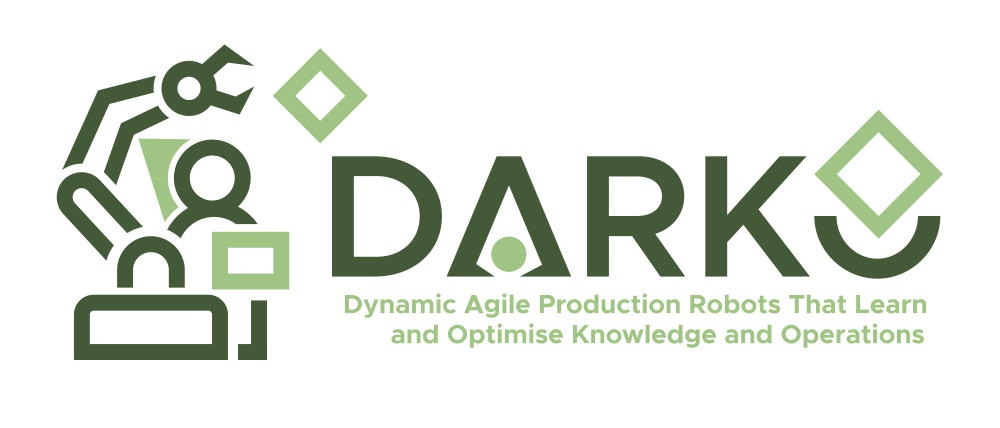
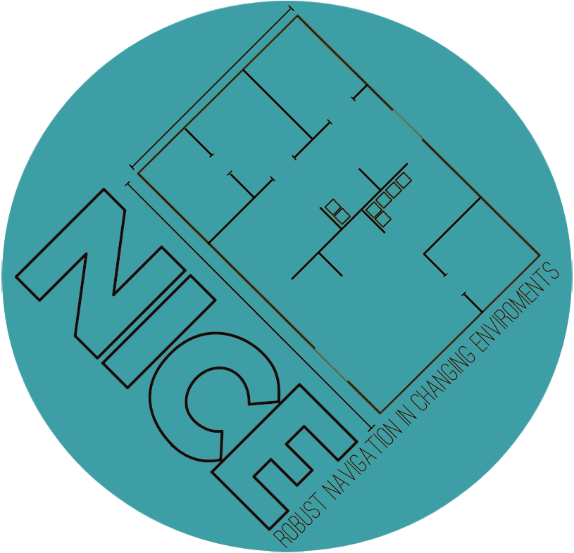

# How good is your map?

## About

Compared to other branches of science and technology, robotics is relatively young. The field as we know it emerged somewhere around the early 1950s. Robotic mapping is even younger, and its history starts around the early 1980s. Despite its short history, robotic mapping has undergone great developments. Nowadays, robotic maps are fundamental for the operation of the majority, if not all, mobile robotic systems. However, despite the importance of the robotic maps, there is no common way to exchange the maps between different manufacturers' robotic platforms, neither there is a consensus regarding what defines a good map. Such a state of the field hampers the development of the field itself and fields depending on it. Developments in engineering usually come when common ways are established to define concepts and components and to measure the performance of such systems and components. Robotics makes no exception. Thus standardisation and assessment (qualitative and, especially, quantitative) of maps are of paramount importance.

## Objectives

Recently a few initiatives have emerged to systematically address these issues and a number of researchers have expressed interest in the problems related to map standardisation and map assessment. We believe this workshop will pave the way towards a more solid and consistent development of standards and quality assessment methods for maps.

The workshop is aimed at a broad audience from academia and industry. The goal is to attract not only researchers and practitioners actively working on the problem of robotic map standardisation and map quality assessment but also representatives of fields depending on high-quality maps. The aim of the
workshop is to spark discussion among the participants to define the objectives for further development of map standardisation and map quality assessment as well as enable broader adoption of already existing solutions.

Considering the importance of the topic as well as its relative obscurity, we aim to use the workshop as a way to advertise it to the broader community. To further facilitate this goal, the summary of the presentations and discussions during the workshop will be used as a foundation of a position paper on the problem. The workshop participants and the broader community will be invited to participate in the process of writing the paper.

## Workshop Format
### Program
WHEN: 2021-08-31
WHERE: https://gather.town/app/yMxITlVsMIVtNDpx/goodmap2021

|EEST |CEST |	JST |	EDT |                |
|Helsinki|Stockholm|Tokyo| Cambridge     |             |
|:---:|:---:|:---:|:---:|:-------------------|
|10:00|09:00|16:00|03:00|	Opening            |
|10:30|09:30|16:30|03:30|	Giorgio Grisetti    |
|11:00|10:00|17:00|04:00|	Magnus Lindhé   |
|11:30|10:30|17:30|04:30|	Coffe Break/ Poster session   |
|12:00|11:00|18:00|05:00|	Max Pfingsthorn|
|12:30|11:30|18:30|05:30|	Naoki Akai |
|13:00|12:00|19:00|06:00| Lunch/ Poster Session |
|14:00|13:00|20:00|07:00|	Francesco Amigoni |
|14:30|13:30|20:30|07:30|	Mirco Colosi|
|15:00|14:00|21:00|08:00|	Tomasz Kucner|
|15:30|14:30|21:30|08:30|	Luca Carlone|
|16:00|15:00|22:00|09:00|	World cafe|
|17:00|16:00|23:00|10:00|	Wrap up|

----
### Invited Speakers

#### Giorgio Grisetti - RoCoCo lab, Sapienza University of Rome, Italy

**Title** SLAM: what still bugs me.

  
Abstract

  Since a few years SLAM systems came out of academia and empower several mobile robot applications. Whereas this is good enough, we believe that a significant effort in the life of a robotic system is spent in requiring maps and data of the same environments. In particular, this is typically done each time the sensor setting or environment conditions change. In these situations it is common to reacquire a new map.

  This is in contrast with the requirements of most SLAM users, that in general need just an up-to-date map suitable for their purposes with the least possible effort.  Seeing SLAM as a service, instead of as a "task" to be done by the robot would significantly lessen the computation required on-board by the robotic system, enhance flexibility and reduce the setup time. Instead of providing solutions, this talk aims at opening a discussion on potential SLAM infrastructures supporting heterogeneous robots.
  

  
About

  Giorgio Grisetti is associate professor at Sapienza University of Rome. He is member of the RoCoCo lab at La Sapienza since November 2010. He is also member of the Autonomous Intelligent Systems Lab. at Freiburg University headed by Wolfram Burgard where he worked as a Post Doc since 2006. His research interests lie in the areas of mobile robotics. His previous and current works aimes to provide effective solutions to mobile robot navigation in all its aspects: SLAM, localization and path planning. He was a PhD student at University of Rome "La Sapienza" in the Intelligent Systems Lab. His advisor was Daniele Nardi and he received his PhD degree in April 2006. His PhD thesis focused on SLAM using Rao-Blackwellized particle filters. In 2001, he received his M.Sc. degree in computer engineering, at the University of Rome
  

#### Luca Carlone - SPARK Lab, MIT, Cambridge MA, USA

**Title** New World Models and How to Build Them: 3D Dynamic Scene Graphs and Certifiable Perception for Robots and Autonomous Vehicles

  
Abstract
  
 Perception algorithms are key components of modern autonomous systems, from self-driving vehicles to autonomous robots and drones. For instance, for a self-driving vehicle, perception algorithms provide functionalities such as estimating the state of the vehicle, building a map of obstacles in its surroundings, and detecting and tracking external objects and pedestrians. In this talk, I present a new hierarchical map representation, namely a 3D Dynamic Scene Graph, that provides a general and expressive model for hierarchical decision-making, human-robot interaction, prediction, and long-term autonomy. I also introduce the first generation of Spatial Perception Engines, that extend the traditional notions of mapping and SLAM, and allow a robot to build a “mental model” of the environment, including spatial concepts (e.g., humans, objects, rooms, buildings) and their relations at multiple levels of abstraction. I then focus on robustness and safety assurance for autonomous systems and discuss ongoing efforts towards the design of certifiable perception algorithms (which achieve extreme robustness to outliers and provide performance guarantees), and system-level monitoring of perception systems (which can detect off-nominal behavior in complex perception systems).

  
About

   Luca Carlone is the Leonardo Career Development Assistant Professor in the Department of Aeronautics and Astronautics at the Massachusetts Institute of Technology, and a Principal Investigator in the Laboratory for Information & Decision Systems (LIDS). He received his PhD from the Polytechnic University of Turin in 2012. He joined LIDS as a postdoctoral associate (2015) and later as a Research Scientist (2016), after spending two years as a postdoctoral fellow at the Georgia Institute of Technology (2013-2015). His research interests include nonlinear estimation, numerical and distributed optimization, and probabilistic inference, applied to sensing, perception, and decision-making in single and multi-robot systems. His work includes seminal results on certifiably correct algorithms for localization and mapping, as well as approaches for visual-inertial navigation and distributed mapping. He is a recipient of the Best Paper Award in Robot Vision at ICRA’20, the 2020 Honorable Mention from the IEEE Robotics and Automation Letters, the Track Best Paper award at the 2021 IEEE Aerospace Conference, the 2017 Transactions on Robotics King-Sun Fu Memorial Best Paper Award, the Best Paper Award at WAFR’16, the Best Student Paper Award at the 2018 Symposium on VLSI Circuits, and he was best paper finalist at RSS’15. He is also a recipient of the NSF CAREER Award (2021), the RSS Early Career Award (2020), the Google Daydream (2019) and the Amazon Research Award (2020), and the MIT AeroAstro Vickie Kerrebrock Faculty Award (2020). At MIT, he teaches “Robotics: Science and Systems,” the introduction to robotics for MIT undergraduates, and he created the graduate-level course “Visual Navigation for Autonomous Vehicles”, which covers mathematical foundations and fast C++ implementations of spatial perception algorithms for drones and autonomous vehicles.

#### Max Pfingsthorn - OFFIS Institute for Information Technology, Oldenburg, Germany

**Title** Can we make more accurate and actionable semantic maps with human and tactile input?

  
Abstract

  Current SLAM systems are evolving rapidly: Novel systems are faster, can manage larger maps, estimate semantic information, can be used in an end-to-end learning regime, and are increasingly robust to outliers. However, crucial training data, e.g. for semantic SLAM, are often missing for operational environments of modern robotic systems. This problem exists in environments from ad-hoc machine tending tasks with novel workpieces to search-and-rescue and underwater settings.
In my understanding, useful semantic SLAM can be thought of as building a sensor-driven world model, up to the point where it can be used for simulation and encoding complex tasks/goals. The challenge is to achieve not only a highly accurate segmented 3D reconstruction, but also a) estimate full 3D shape of objects, b) estimate non-visual properties of objects (e.g. mass, friction), and c) do all this in a novel environment with novel objects.
In this talk I will describe two research lines in my group to address these challenges. One focuses on tactile exploration to learn about objects interactively and construct symbolic knowledge while the other focuses on transferring human knowledge through 3D interactions to a perception system.
  

  
About

  Max Pfingsthorn is a principal scientist and leads the "Smart Human-Robot Collaboration" research group in the R&D Division Manufacturing at the OFFIS Institute for Information Technology in Oldenburg, Germany. He received his PhD with distinction from Jacobs University Bremen in 2014 focusing on robust (fault-tolerant) simultaneous localization and mapping for single robots and robot teams. He received his Masters in AI and Bachelors in EECS from University of Amsterdam and Jacobs University, respectively. He leads multiple research and transfer projects on regional, national, and European levels. Max is most excited about linking robots and humans on a cognitive level (especially regarding semantic environment and task models) and making people more productive with robot hardware that is available today.
  

#### Tomasz Piotr Kucner - AASS Research Centre, Örebro University, Sweden

**Title** Reference Free Map Quality Assessment

  
Abstract

  Problem of map building has received a substantial amount of attention over past 37 years. That includes rapid development of SLAM algorithms as well as other methods. However, in practice even the most advanced algorithms still requires expert to supervise the mapping process and assess the final product. Such practice substantially limits the mapping capabilities of robotic system and increases the deployment costs. The limited supervision is only present in non-critical robotic setups. Thus to truly assure robotic autonomy it is necessary to enable robotic platforms to autonomously and automatically monitor the quality of the collected data as well as the quality of the resulting model.

In my talk I will discus different indicators of good map and ways to measure them. I will also disuse the impact of map quality on the navigation, task planning and motion planning. I will conclude the talk with possible solutions for these problems.
  

  
About

 Tomasz Kucner is a postdoc at Örebro University. His work is focused on the problems of mapping, semantic mapping and navigation, with a focus on building maps of dynamics and map quality assessment. His recent work addresses problems of building and applying spatial models of dynamics as well as  He is a vice-chair of IEEE WG on 3D Map Data Representation.
  

#### Naoki Akai - Graduate School of Engineering, Nagoya University, Japan

**Title** Detection of Localization Failures with Probabilistic Modeling

  
Abstract

   Almost all modules used for autonomous navigation rely on localization results. Hence, localization failures might result in autonomous navigation failures as well. To guarantee safety of the autonomous navigation, we are focusing on how to detect the localization failures automatically. In this talk, I present probabilistic modeling methods to estimate reliability of the localization result and to recognize misalignment between sensor measurements and map. These methods enable a robot to know whether localization has failed or not itself.

  
About
 Naoki Akai received his B.S., M.S., and Ph.D degrees in Mechanical Engineering from Utsunomiya University, Japan, in 2012, 2013, and 2016, respectively. In 2016, he moved to Nagoya University. Since 2020, he has been an Assistant Professor at the Graduate School of Engineering, Nagoya University. His current research interests include localization, perception, and intelligent systems for autonomous  mobile robots, cars, and aerial robots. He is also interested in applying topological techniques to robotics applications.

#### Magnus Lindhé - Electrolux Home Care & Small Domestic Appliances, Stockholm, Sweden

**Title** A consumer robot perspective on map quality

  
Abstract
 The Electrolux Pure i9 series of robotic vacuum cleaners was launched in 2017 and we now have more than 100 000 connected robots globally. I will briefly introduce the 3D laser scanner on the robot, and the map format that the robots use to report every cleaning session to our cloud servers. I will then outline some current challenges that we see in map quality assessment, both from the perspective of the user impression as well as what the robot needs. Finally, I will comment on how map standardization could be useful for our application.

  
About
 Magnus Lindhé got his PhD in automatic control, applied to robotics, from the KTH Royal Institute of Technology in 2012. Since then, he has worked at Electrolux in Stockholm, with navigation and planning for robotic vacuum cleaners. He was recently appointed manager of the advanced development team in robotics, which is now recruiting for a specialist in computer vision and/or machine learning.

#### Francesco Amigoni - AIRLab, Politecnico di Milano, Milan, Italy

**Title** Standardizing robot map representations

  
Abstract
 The availability of maps of environments in which they operate enables several tasks for autonomous robots. The IEEE Robotics and Automation Society has published a standard, called IEEE 1873-2015 Robot Map Data Representation for Navigation, that defines a common representation for 2D robot maps intended to facilitate interoperability among navigating robots. The standard is being currently extended to represent 3D maps.
The talk will survey these efforts, and those from other standard development organizations, in order to provide a picture of the current standardization activities relative to representations of robot maps.

  
 About 
 Francesco Amigoni is professor at Politecnico di Milano (Italy), where he had previously been assistant professor and associate professor. He has been vice-chair of the Standard Working Group that developed the IEEE 1873-2015 Standard for Robot Map Data Representation for Navigation and he he is now chair of the Standard Working Group that is developing an extension of the standard to 3D maps. His main research interests are in Autonomous Robotics (multirobot systems, mapping, anomaly detection) and in Artificial Intelligence (multiagent systems, distributed decision making, and distributed optimization).

#### Mirco Colosi - Robert Bosch GmbH, Stuttgart, Germany

**Title** Standardizing SLAM: exploiting recurrent patterns for modularity and behavioral robustness

  
Abstract
 Robots have become present in our everyday life. Robotic vacuum cleaners and lawnmowers take care of our homes, self-driving cars provide personal mobility in radically new ways, collaborative production assistants work side-by-side with humans in modern factories, and last-mile delivery platforms transport goods to their destination in intralogistics and urban spaces. These and many other applications have in common the need for an internal representation of the surrounding environment and require knowing the pose of the robot within this environment. In view of this, researchers during last decades invested substantial effort in finding solutions to this problem, converging in a field named SLAM. In last years, the evolution of this field brought major breakthroughs that lead to structural changes in the core algorithms and the way the SLAM problem was framed. This dynamic evolution made it difficult to find a unified SLAM formulation that generalizes the different research lines pursued by various research laboratories around the world. However, nowadays the field reached a certain plateau, where all the state-of-the-art SLAM systems converged towards a graph-based formulation. We believe that it is time for standardization in SLAM and propose a unification approach that defines generalized SLAM interfaces, allowing for fast prototyping thanks to the interchangeability of the basic components developed from different authors. In addition to the architecture, we address the behavioral aspect of SLAM that plays an important role in the robustness of the system. Reasoning on a higher level of abstraction, above the mere geometric one, is key in robustly handling unforeseen events. In our approach, we create a behavioral control layer on top of a regular SLAM system, which guides the evolution of the SLAM system deciding the best task to accomplish according to external events, such as robot being lost, able to localize, and so on.

In this talk, we address these problems by proposing a novel approaches and improvements, derived from a careful analysis of the state-of-the-art, spotting, and avoiding their weaknesses while investigating how to combine their strengths. We developed a standardized architecture for multi-sensor SLAM system able to cope with arbitrary robot setups, providing also two fully configurable and working pipelines, and a behavioral controller for SLAM systems, capable of handling unforeseen events, choosing the best next action to accomplish when needed.

These contributions further advance SLAM towards a mature research field as they provide a generalized view of the problem formulation and system designs. They also have a significant practical impact. Unlike state-of-the-art systems, the considered modal aspects of SLAM are shown to play a key role in robustly dealing with situations that robots face when deployed autonomously in open-world environments.

  
 About 
 Mirco Colosi is a Research Scientist at Robert Bosch GmbH in the department of Mapping, Localization and Navigation (CR/AAS3). He received his Ph.D. in Engineering in Computer Science from Sapienza University of Rome in collaboration with Robert Bosch GmbH under the co-supervision of Prof. Giorgio Grisetti (Sapienza) and Dr. Kai O. Arras (Bosch). During the studies, he covered the architectural and behavioral aspects of modern SLAM systems. His main research focus is Mobile Robotics, spanning the navigation stack, from control to mapping and localization.

----

### World Café

#### Discussion Format
To encourage and stimulate the discussion during the workshop, we will use [World Cafe Method](http://www.theworldcafe.com/key-concepts-resources/world-cafe-method/). World Cafe method is designed to enable successful discussion within a large group of participants though splitting them into small focused groups discussing one particular question, at the end the results of the discussion are presented to the whole audience.

During this workshop the participants will be split into four equal groups and each group will discuss one of the questions listed bellow for 15 minutes and then switch to another one. At the end of the workshop moderators responsible for each question will present the results of the discussion to the whole audience.

#### Discussion Topics
1. What characterizes a good map and how to assess them
2. How to present information encoded in a robotic map in a human readable format?
3. What is the basic spatial information that should be encoded in a (standardised) map?
4. What domains/industries are in need of map standards and map quality assessment?

#### Outcome

We want that this workshop in general and the discussion in particular to impact the broader robotic community. To achieve this, we have decided to write a white/position paper outlining the importance of the map standardization and quality assessment in robotics. The planed paper will also contain the list of open research questions related to the problems discussed during this workshop.

## Call for Papers/Posters

### Summary

**Submission Deadline**: 2021-08-15

**Notification**: 2021-08-21

**Submission Link**: [https://easychair.org/conferences/?conf=goodmap2021](https://easychair.org/conferences/?conf=goodmap2021)

----
### Call
Maps are fundamental for the operation of most, if not all, mobile robotic systems. Even though it is a young field compared to other branches of science and technology, robotic mapping has undergone great developments. However, despite the importance of robotic maps, there is no consensus regarding what defines a good map, nor is there a common way to exchange maps between different manufacturers’ robotic platforms. These shortcomings hamper the development of the field of mapping for mobile robots as well as other fields that depend on it. Developments in engineering usually come when common ways are established to define concepts and components and to measure the performance of such systems and components. Robotics is no exception. Thus standardisation and assessment -- qualitative and, especially, quantitative -- of maps are of paramount importance.

We warmly welcome contributions of papers targeting the workshop's scope, which includes but is not limited to the following topics:
----
### Topics of Interest

In this workshop, we will address the following (non-exhaustive) list of topics:
* Reference-Free Map Quality Assessment
* Reference-Based Map Quality Assessment
* Certifiable SLAM
* Generalisable Quality Estimates for Scan Matching
* Failure Resilient Mapping
* Theoretical Bounds for Mapping and Localisation Methods
* Map Standardization for Data Exchange
* Map Quality Assessment in the Context of Map Standardisation
* Map Standardisation for Map Communication (HRI)
* Trustworthy AI and Standardisation
* Groundtruth Generation for Map Quality Assessment
* Map Standardisation in Industrial Applications

----

### Information for Authors
- All submissions will be reviewed (single-blind) by the program committee.
- Please use the IEEE template [https://www.ieee.org/conferences/publishing/templates.html](https://www.ieee.org/conferences/publishing/templates.html)
- Maximum: 2 pages (excluding references)
- For the final presentation, a poster will be required.

## Organizers
**Tomasz Piotr Kucner**
AASS Research Centre, Örebro University, Sweden
tomasz.kucner@oru.se

**About** Tomasz Kucner is a postdoc at Örebro University. His work is focused on the problems of mapping, semantic mapping and navigation, with a focus on building maps of dynamics and map quality assessment. His recent work addresses problems of building and applying spatial models of dynamics as well as  He is a vice-chair of IEEE WG on 3D Map Data Representation.

**Martin Magnusson**
AASS Research Centre, Örebro University, Sweden
martin.magnusson@oru.se

**About** Martin Magnusson is an associate professor at Örebro University. His research is concerned with localisation, mapping and 3D perception for mobile robots, with a particular interest in field applications and low-visibility scenarios. Recent work includes mapping and using flow data for mobile robots, and using heterogeneous map sources. He was a vice-chair of IEEE WG on 2D Map Data Representation and co-authored IEEE 1873-2015 - IEEE Standard for Robot Map Data Representation for Navigation, and is co-coordinating the euRobotics topic group on robotics for logistics and transport.

**Francesco Amigoni**
AIRLab, Politecnico di Milano, Milan, Italy
francesco.amigoni@polimi.it

 

 **About** Francesco Amigoni is an associate professor at Politecnico di Milano. His main research interests include autonomous mobile robotics and multiagent systems and, in particular, he has mainly addressed problems in map building and multirobot coordination. He contributed, as vice-chair of the Standard Working Group, to the development of the IEEE 1873-2015 Standard for Robot Map Data Representation for Navigation and he is now chair of the Standard Working Group that is developing an extension of the IEEE 1873-2015 Standard to 3D maps.

## Program Committee
**Matteo Luperto** AIS Lab, University of Milan, Italy

**Francesco Verdoja** Intelligent Robotics, Aalto University, Finland

## Funding and Support

This project has received funding from the European Union’s Horizon 2020 research and innovation programme under grant agreement No 101017274 (DARKO)

This project has received funding from the Knolwedge Foundation under  contract  number 20200247(NICE)
